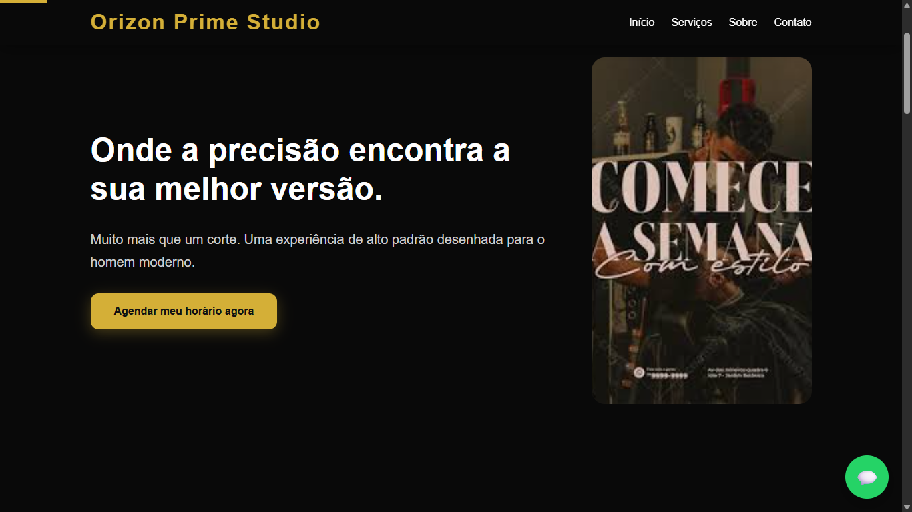

# Orizon Prime Studio

Landing page moderna e responsiva desenvolvida para praticar e aprimorar habilidades em desenvolvimento frontend, com foco em experiência do usuário, animações suaves e interface premium.

---

## 🚀 Preview

🔗 Deploy do projeto:  
https://bruno123-n.github.io/orizon-prime-studio/



---

## ✨ Funcionalidades

- Menu mobile responsivo
- Hero section moderna
- Modal de imagens
- Scroll suave
- Animações ao aparecer na tela
- Barra de progresso de scroll
- Botão flutuante do WhatsApp
- Botão "voltar ao topo"
- Lazy loading de imagens
- Layout totalmente responsivo

---

## 🛠️ Tecnologias utilizadas

- HTML5
- CSS3
- JavaScript (ES6+)

---

## 📱 Responsividade

O projeto foi desenvolvido com foco em responsividade, funcionando corretamente em:

- Desktop
- Tablets
- Smartphones

---

## 📂 Como executar o projeto

```bash
# Clone o repositório
git clone https://github.com/bruno123-n/orizon-prime-studio.git

# Abra o index.html no navegador
```

---

## 🌐 Deploy

Projeto hospedado com GitHub Pages.

---

## 👨‍💻 Autor

Desenvolvido por Bruno Lima.

